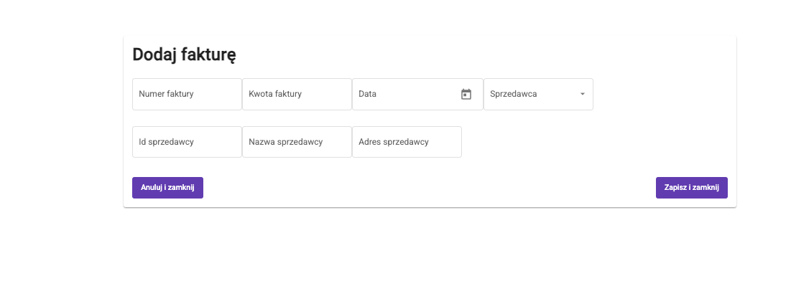
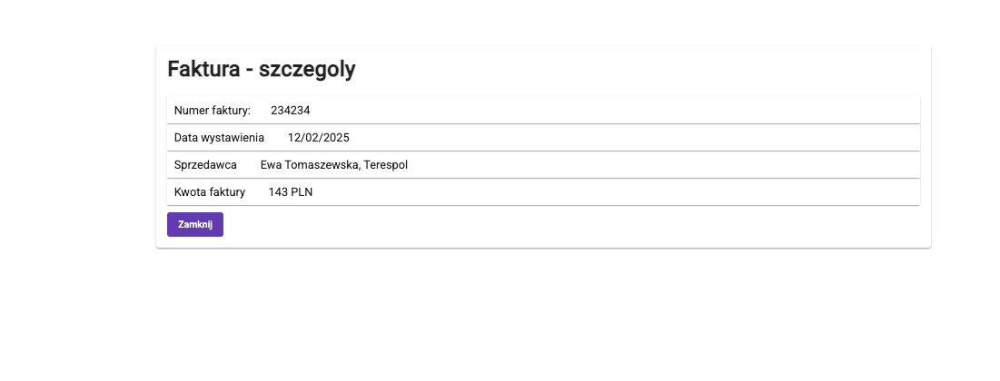

# Invoice App

## Overview
This application allows users to manage invoices.

## Screenshots

### Lista Faktur

### Nowa Faktura

### Szczegoly faktury

## Video
<video width="600" controls>
  <source src="./video.mp4" type="video/mp4">
  Your browser does not support the video tag.
</video>

## Screens
* Invoice List
  * Columns:
    * Invoice number,
    * Seller name,
    * Invoice amount
  * Filters:
    * Seller: select the seller from the seller registry (drop down)
* Adding an Invoice
  * Fields:
    * Invoice issue date
    * Invoice number,
    * Seller: select from the seller registry, after selection, full seller details are displayed (id, name, address)
    * Invoice amount
  * Actions:
    * Save (sends the new invoice to the backend)
    * Cancel (closes the window without saving)
* Invoice Preview (readonly presentation of the invoice)
  * Fields:
    * Invoice issue date
    * Invoice number,
    * Seller: select from the seller registry,
    * Invoice amount
  * Actions:
    * Close (closes the window without saving)

## Installation
<!-- ...existing code... -->

## Usage
<!-- ...existing code... -->

## Contributing
<!-- ...existing code... -->

## License
<!-- ...existing code... -->
