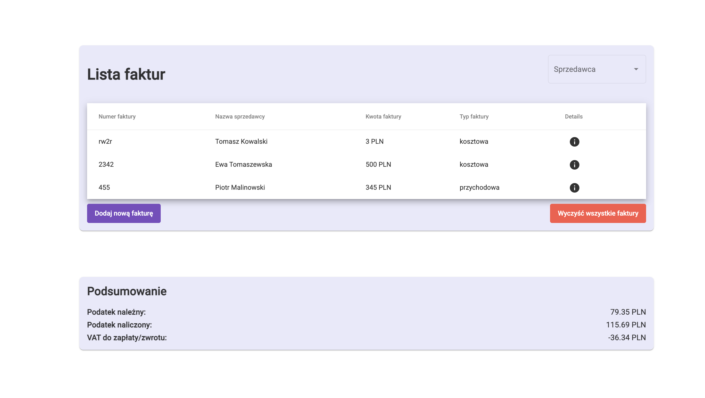
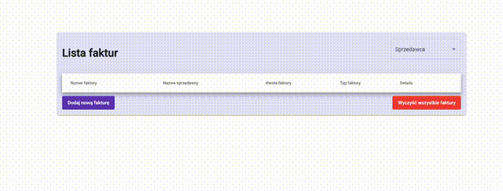

# Invoice App

## Overview
This application allows users to manage invoices.

## Screenshots

### Lista Faktur


### Nowa Faktura


### Szczegoly faktury


## Video


## Screens
* Invoice List
  * Columns:
    * Invoice number,
    * Seller name,
    * Invoice amount
  * Filters:
    * Seller: select the seller from the seller registry (drop down)
* Adding an Invoice
  * Fields:
    * Invoice issue date
    * Invoice number,
    * Seller: select from the seller registry, after selection, full seller details are displayed (id, name, address)
    * Invoice amount
  * Actions:
    * Save (sends the new invoice to the backend)
    * Cancel (closes the window without saving)
* Invoice Preview (readonly presentation of the invoice)
  * Fields:
    * Invoice issue date
    * Invoice number,
    * Seller: select from the seller registry,
    * Invoice amount
  * Actions:
    * Close (closes the window without saving)

## Installation

1. Clone the repository:
   ```sh
   git clone https://github.com/your-username/faktury_app-main.git
   cd faktury_app-main
   ```

2. Install dependencies:
   ```sh
   npm install
   ```

3. Run the application:
   ```sh
   ng serve
   ```

4. Open your browser and navigate to:
   ```
   http://localhost:4200
   ```

## Configuration

1. Update the `src/environments/environment.ts` file with your configuration settings.

2. Configure the local storage keys in `src/app/common/constants.ts`:
   ```typescript
   export const FAKTURY_LOCAL_STORAGE_KEY = 'faktury';
   export const SPRZEDAWCY_LOCAL_STORAGE_KEY = 'sprzedawcy';
   export const URL_HOME = '/home';
   export const URL_FAKTURA = '/faktura';
   ```

## Usage
<!-- ...existing code... -->

## Contributing
<!-- ...existing code... -->

## License
<!-- ...existing code... -->
