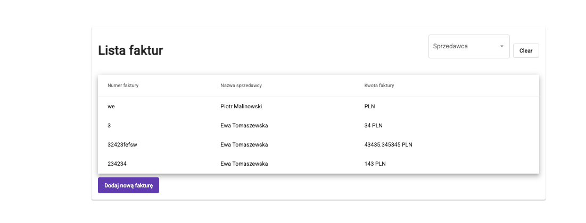

# Faktury App

## Overview
This application allows users to manage invoices.

## Screenshots

### Lista Faktur

### Nowa Faktura

## Ekrany
* Lista faktur
  * kolumny:
    * numer faktury,
    * nazwa sprzedawcy,
    * kwota faktury
  * filtry:
    * sprzedawca: sprzedawcę wybieramy z rejestru sprzedawców na podstawie (drop down)  
* Dodawanie faktury
  * pola:
    * data wystawienia faktury
    * numer faktury,
    * sprzedawca wybór z rejestru sprzedawców, po wybraniu widzimy pełne dane sprzedawcy (id, nazwa, adres)
    * kwota faktury
  * akcje:
    * zapisz (wysyła nową fakturę na backend)
    * anuluj (zamyka okno bez zapisywania)
* Podgląd faktury (prezentacja faktury readonly)
  * pola:
    * data wystawienia faktury
    * numer faktury,
    * sprzedawca wybór z rejestru sprzedawców,
    * kwota faktury
  * akcje
    * zamknij (zamyka okno bez zapisywania)

## Installation
<!-- ...existing code... -->

## Usage
<!-- ...existing code... -->

## Contributing
<!-- ...existing code... -->

## License
<!-- ...existing code... -->
